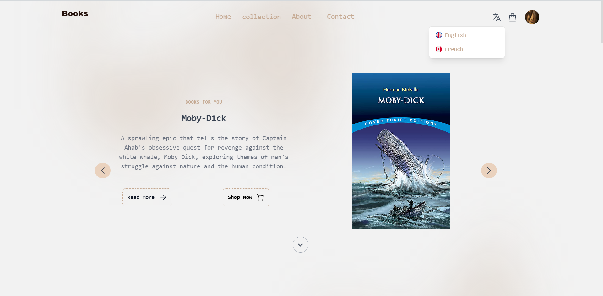

# bookstore

Online Bookstore For End Study Project

<--- Steps To Run App --->

# Step One

- Installer les dépendances requises : Assurez-vous que la nouvelle machine dispose des dépendances nécessaires installées. Cela inclut Node.js, npm (Node Package Manager), PHP et Composer. Installez ces outils s'ils ne sont pas déjà disponibles sur la nouvelle machine.

# Step Two

- Configurer la base de données : Exportez la base de données depuis votre ordinateur portable et importez-la dans le système de base de données de la nouvelle machine. Cela implique généralement de créer une nouvelle base de données sur la nouvelle machine et d'importer le fichier de sauvegarde SQL ou le fichier de sauvegarde de la base de données depuis votre ordinateur portable.
  => fichier "booksstore.sql"

# Step Three

- Mettre à jour les variables d'environnement : Modifiez les variables d'environnement dans votre application Laravel pour refléter les paramètres de la base de données sur la nouvelle machine. Ces variables sont généralement stockées dans un fichier .env à la racine de votre projet Laravel. Mettez à jour les valeurs des variables liées à la base de données, telles que DB_HOST, DB_PORT, DB_DATABASE, DB_USERNAME et DB_PASSWORD, pour correspondre aux paramètres de la base de données sur la nouvelle machine.
  => fichier ".env"

# Step Four

- Installer les dépendances du projet : Ouvrez un terminal ou une invite de commande sur la nouvelle machine, accédez au répertoire racine de votre application React Laravel, et exécutez les commandes suivantes :

Installer les dépendances Laravel Dossier backend
composer install

Installer les dépendances React Dossier frontend
npm install

# Step Five

- Construire l'application React : Après avoir installé les dépendances, générez l'application React en exécutant la commande suivante :

Dossier frontend
npm run prod

# Step Six

Dans Dossier backend
php artisan serve

Dans Dossier frontend
npm run dev

# Step Seven

- Ouvrez un navigateur web sur la machine et accédez à l'URL localhost:3000

